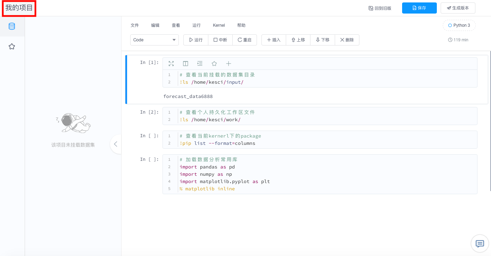

# 数据分析项目
## 创建项目
用户可以在`我的项目`中创建自己的项目。
点击`+`创建项目。
* 填写项目名称：用户对将要创建项目的命名。
* 填写项目描述：用户对将要创建项目的描述，不超过140字符。
* 设置项目权限：用户可以创建私有项目和公开项目。公开项目可被全网用户访问，私有项目只能由用户个人或者通过用户分享的项目链接进行访问。**K-Lab默认的项目权限为私有项目，用户可将其转为公开项目，但公开项目无法转回私有项目。**
* 设置项目环境：用户创建的项目需要配置运行环境，K-Lab支持**Python 2 & 3** 和 **R** 这三种运行环境。用户可在项目运行时自由切换环境。
* 添加项目数据集：用户可以在创建项目时直接添加将要使用的数据集。在创建项目之后，如果需要补充数据集，可以通过`修改项目属性`进行数据集的添加。
* 上传本地IPython Notebook文件：K-Lab支持原生```.ipynb```文件，用户可以直接上传本地的Notebook文件导入K-Lab完成后续编写运行。

## Fork项目
在k-lab社区中，当用户想对别人创建的项目进行学习研究或者编辑时，可以开启Fork。
* 什么是Fork：用户点击`Fork`后，可以创建一个内容与被Fork项目Notebook内容相同的新项目。在这个项目里，用户可以自由进行编辑和修改操作。
* 如何Fork项目：项目页面点击蓝色的`Fork`按钮。
  
* Fork来源：用户选择Fork的项目名称。
* 项目名称：用户可以更改项目名称。
* 项目描述：用户可以更改项目描述。
* 项目权限：用户可以选择项目权限。
温馨提示：私有项目可以转为公开项目，而公开项目不可转回私有项目。

## 运行项目
* 启动项目：完成项目创建后，在弹出的对话框选择`运行`，便可启动Notebook及Kernel环境，导入数据集，写代码作分析，进行自己的创作。
* 重命名项目：在Notebook页面点击左上角的项目名称，能够对项目名称进行修改。
  
* 保存项目：在Notebook页面点击保存按钮，保存对项目的更改。
  
* 生成版本：在Notebook页面点击生成版本按钮，该操作将基于当前工作区内容生成一个新的版本。生成版本后，用户才能在`我的项目`中进行项目管理.
  

## 管理项目
用户可以通过[K-Lab页面`(#)直接访问个人项目，并完成**运行项目**，**修改项目属性**，**删除项目**，**分享项目**等操作。能够看见项目的作者、编程语言、更新时间，内容，Fork记录以及评论。

* 修改项目权限：用户可将私有项目转化为公开项目，但无法将公开项目转化为私有项目。更多内容请参考[设置项目权限](chapter5.md#创建项目)
* 控制项目版本：一个项目在公开之后，便会生成一个可见版本，每次修改保存并生成新版本后，修改的项目版本才能可见。用户可以在`我的项目`页面下对自己的可见项目进行版本管理，如选择一个版本进行查看、运行、修改、保存生成新版本。
* 删除项目：项目一经删除，无法找回。
* 分享项目：在`我的项目`页面下，点击`分享`按钮，即可通过扫描二维码的方式将项目以链接形式分享给他人。链接的持有者注册科赛网账户后即可通过Fork的形式对项目进行编辑，并生成在个人账户下的新项目。